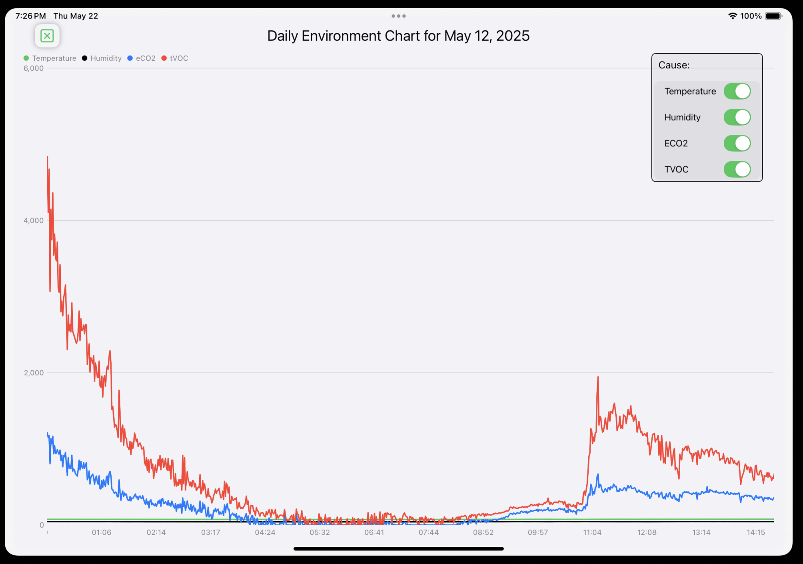

1. Sample Data from Firebase Firestore
```
      0046sa5vLc00OjjKPIGD ->
      AirQualityCharts.AQSample(
      id: 46015,
      TVOC: 11,
      dt: 2025-05-18 22:27:00 +0000,
      eCO2: 400,
      forwarder: Optional("forwarder_NAS-220P"),
      humidity: 40.6,
      temperature: 78.5)
```


